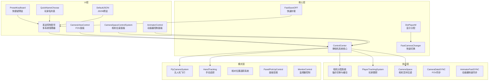
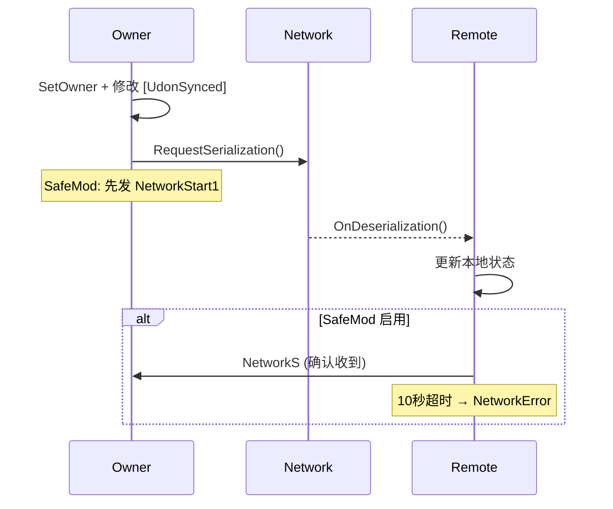

# VRChat Technical Director System（VRChat 技术导演系统）

> 📅 分析日期：2026-06-04  
> 🎯 目标平台：VRChat World (PC + Quest)  
> 🛠️ SDK：VRChat World SDK 3.x + UdonSharp  
> 🎮 Unity：2022.3.22f1

---

## 目录

1. [项目概述](#1-项目概述)
2. [系统架构](#2-系统架构)
3. [模块详解](#3-模块详解)
4. [数据流与同步架构](#4-数据流与同步架构)
5. [目录结构](#5-目录结构)
6. [脚本清单](#6-脚本清单)
7. [已识别问题](#7-已识别问题)
8. [技术债务与建议](#8-技术债务与建议)

---

## 1. 项目概述

**VRChat Technical Director System** 是一套用于 VRChat 世界的虚拟影视拍摄/监控系统。它模拟了真实电视制作中的多机位切换、摄像机运动控制、参数同步等功能，允许玩家在 VRChat 中实现类似"技术导演"的工作流。

### 核心功能

| 功能 | 描述 |
|------|------|
| 📷 **多相机系统** | 支持多个独立相机实例，每个可配置不同的跟踪目标和渲染输出 |
| 🎯 **玩家跟踪** | 跟踪玩家头部、手部、模型原点，支持位置/旋转偏移和锁定 |
| 🔄 **相机平滑切换** | 相机锚点之间支持 Slerp 平滑过渡，可分轴独立缓动 |
| 🎚️ **FOV 控制** | 自动速率模式和手动缓冲模式两种 FOV 控制方式 |
| 🎬 **动画器远程控制** | 远程控制 Animator 的 Float/Int/Bool 参数，支持自动播放 |
| 🖥️ **多显示器输出** | 支持切换不同相机画面到多个屏幕材质 |
| 🚁 **无人机模式** | 第一人称无人机飞行（Station 进入），支持 VR/PC 双模式 |
| ✋ **手动追踪模式** | 手动控制跟踪点位，支持相对追踪和自动追踪 |
| 💾 **预设系统** | JSON 格式的摄像机配置保存/加载，支持 Ctrl+0~9 快捷键 |
| 📺 **可拾取监视器** | 可抓取的监视器屏幕，支持切换 RenderTexture、缩放调整 |

### 设计理念

```
多机位 → 多显示器 → 导演控制台
   │          │            │
   ├─ 相机分配  ├─ DisPlayerM  ├─ ControlCenter
   ├─ 无人机    ├─ FastCamera  ├─ 发送控制信号
   ├─ 手动追踪  │   Changer    ├─ DefaultJSON
   └─ 玩家追踪  └─ Monitor    └─ PresetKeyBoard
```

---

## 2. 系统架构

### 2.1 层级结构



### 2.2 同步模式选择

| 脚本 | 同步模式 | 合理性 |
|------|----------|--------|
| `ControlCenter` | Manual | ✅ 离散状态变更，合理 |
| `CameraViewControl` | Continuous | ⚠️ FOV 连续变化用 Continuous 合理，但内部手动调用 RequestSerialization |
| `CameraDataSYNC` | Manual | ✅ 按需同步 FOV |
| `AnimatorControl` | Manual | ✅ 离散参数变更 |
| `AnimatorFastSYNC` | Continuous | ✅ Float 值连续插值合理 |
| `DisPlayerM` | Manual | ✅ 切换信号 |
| `PlayerTrackingSystem` | Manual | ✅ 离散配置变更 |
| `HandTracking` | Manual | ✅ 离散参数 |
| `FastSaveOFF` | Manual | ✅ 存储操作 |
| `CameraSpace` | Manual | ✅ 位置/旋转变更 |
| `发送控制信号` | NoVariableSync | ✅ 纯本地 UI |

---

## 3. 模块详解

### 3.1 ControlCenter（单相机系统核心）

**文件**: `UScrip/ControlSystem/ControlCenter.cs`  
**同步模式**: Manual  
**作用**: 每个相机实例的核心控制器。

**关键变量**:
| 变量 | 类型 | 同步 | 说明 |
|------|------|------|------|
| `VoidNameID` | int | ✅ | 当前跟踪模式 ID（0=关闭, 1+=子系统索引） |
| `CameraTrackingTarget` | int | ✅ | 当前跟踪锚点索引 |
| `Slarp` | bool | ✅ | 是否启用缓动 |
| `UseUdon` | bool | ✅ | 是否启用子系统的 Udon 逻辑 |

**核心流程**:
1. `Start()` → 初始化 RenderTexture、相机、子系统引用
2. `StartChanger()` → 用户触发 → 获取所有权 → `RequestSerialization()`
3. `OnDeserialization()` → 调用 `CallCamera()` 激活对应子系统
4. 缩略图循环：`ThumbnailUpdate()` → `CameraRefreash()` 定时刷新

**网络重传机制** (SafeMod):
- `RequestSerializationSafe()` → 向所有客户端发 `NetworkStart1`
- 非 Owner 客户端响应 `NetworkS` → Owner 执行 `RequestSerialization()`
- 10 秒超时 → `NetwokEnd` → `NetworkError` → 重新 `RequestSerialization()`

### 3.2 发送控制信号（多系统管理器）

**文件**: `UScrip/ControlSystem/发送控制信号.cs`  
**同步模式**: NoVariableSync  
**作用**: 管理多个相机系统实例，提供切换 UI。

**核心流程**:
1. 维护 `System[]` 数组（多个 ControlCenter GameObject）
2. `InteractStart()` → 将当前 UI 参数（模式、跟踪目标、玩家名、缓动等）写入选定系统的 ControlCenter
3. `CameraChanger()` → 切换当前选中的相机系统索引

### 3.3 相机分配系统（锚点切换）

**文件**: `UScrip/ControlSystem/相机分配系统.cs`  
**同步模式**: None（纯本地）  
**作用**: 管理相机锚点（Targets），控制相机在锚点间的平滑过渡。

**关键特性**:
- 支持 Slerp 缓动（位置+旋转）
- 可分轴独立缓动（`positionSlarp` / `positionSlarpV`）
- `Update()` 中每帧更新相机位置/旋转
- `ChangerTarget()` → 切换锚点 → 可选启用子系统 Udon

### 3.4 PlayerTrackingSystem（玩家跟踪）

**文件**: `UScrip/ControlSystem/PlayerTrackingSystem.cs`  
**同步模式**: Manual  
**特性**: 使用 `[NetworkCallable]` (SDK 3.8.1+) 进行参数同步

**跟踪类型**:
| TrackingID | 跟踪部位 |
|------------|----------|
| 0 | 头部 (Head) |
| 1 | 左手 (LeftHand) |
| 2 | 右手 (RightHand) |
| 3 | 模型原点 (Origin) |

**网络调用链**: `CallTempChanger()` → `NetworkCalling.SendCustomNetworkEvent` → `SetTrackingDataType()` → 延迟1s → `NetworkingCall()` → `RequestSerialization()`

### 3.5 CameraViewControl（FOV 控制）

**文件**: `UScrip/CameraViewControl.cs`  
**同步模式**: Continuous  

**双模式**:
- **自动模式** (`SystemOpenState`): FOV 随速率持续变化，支持手柄
- **手动模式** (`SystemOpenState1`): FOV 缓冲移动到目标值

**非 Owner 行为**: 使用 `Compensation` 插值因子平滑跟踪同步值

### 3.6 AnimatorControl（动画器远程控制）

**文件**: `UScrip/AnimatorControl.cs`  
**同步模式**: Manual  

**控制的参数**: Float1, Int1-3, Bool1-4

**特殊功能**:
- 自动播放：Slider 从当前值自动递增到 1.0
- 快速同步模式：启用 `AnimatorFastSYNC` (Continuous) 进行 Float 平滑插值
- 网络重传机制（与 ControlCenter 类似）
- `OnPlayerJoined` → 迟加入玩家自动同步状态

### 3.7 FlyCameraSystem（无人机系统）

**文件**: `UScrip/ModeCode/无人机/FlyCameraSystem.cs`  
**模式**: Station-based（进入 Station 后操控）

**操控方式**:
- **PC**: 键盘 WASD + QE 旋转 + 鼠标
- **VR**: VR 手柄追踪

**特性**: 速度倍率、缓动、相对/绝对模式、自动旋转、玩家跟踪模式

### 3.8 DisPlayerM / FastCameraChanger（显示管理）

**DisPlayerM**: 切换主显示器的 RenderTexture 源（相机画面或 TV 画面）  
**FastCameraChanger**: 批量初始化多个显示器和 TV 显示器的 RenderTexture

### 3.9 预设系统

| 组件 | 文件 | 功能 |
|------|------|------|
| JSON预设管理 | `DefaultJSON.cs` | 保存/加载相机配置为 JSON |
| 快捷键预设 | `PresetKeyBoard.cs` | Ctrl+0~9 加载预设 |
| 快速存取 | `FastSaveOFF.cs` | 快速保存/恢复所有系统的配置 |
| 玩家名列表 | `QuickNameChoose.cs` | 动态生成玩家名按钮列表 |

---

## 4. 数据流与同步架构

### 4.1 所有权模型

```
Master/Owner 模式（默认）:
  - ControlCenter GameObject → 操作者获得所有权
  - Camera GameObject → 操作者获得所有权
  - 非 Owner 只能读取，不能写入

所有写入路径:
  1. Networking.SetOwner(LocalPlayer, gameObject)
  2. 修改 [UdonSynced] 字段
  3. RequestSerialization()
  4. 非 Owner 通过 OnDeserialization() 接收
```

### 4.2 网络事件流



### 4.3 RenderTexture 管线

```
Camera (enabled when needed)
  └─ targetTexture = RenderTEX
       ├─ material[].SetTexture("_MainTex", RenderTEX)  [缩略图]
       ├─ CameraM.SetTexture("_MainTex", CameraRender[i]) [预览]
       ├─ CameraDisplay.material.SetTexture(...) [主显示]
       └─ Monitor MeshRenderer.material.SetTexture(...) [监视器]
```

---

## 5. 目录结构

```
Assets/RhineLab/VRChat Technical Director system/
├── Animator/                    # 动画控制器
│   ├── GameObject.controller    # 主动画控制器
│   ├── 默认-系统1.controller
│   ├── 默认-系统2.controller
│   └── 默认动画/               # 默认动画片段
├── Material/                    # 材质
├── MODEL/                       # 3D 模型
│   ├── frame.fbx               # 相框模型
│   └── roundbox.fbx            # 圆角盒模型
├── Perfeb/                      # 预制件
│   ├── 相机系统（全套）.prefab
│   ├── 拆分/
│   └── Prefeb旧版本/
├── rounded_trail/               # 圆角拖尾效果
├── Scene/                       # 场景
│   ├── sample.unity            # 主场景
│   └── 拆分.unity
├── Texture/                     # RenderTexture 资源
│   ├── TVRender.renderTexture
│   └── 显示1~4.renderTexture
├── UI/                          # UI 图片资源
│   ├── 1920x1080.png
│   ├── 200x200.png / special / texture
│   ├── cameranotfound.png
│   ├── frame.png
│   ├── logo.png
│   ├── Font/
│   └── icon/
├── UScrip/                      # 🔑 所有 UdonSharp 脚本
│   ├── AnimatorControl.cs / .asset
│   ├── AnimatorFastSYNC.cs / .asset
│   ├── BottonIndex.cs / .asset
│   ├── CameraDataSYNC.cs / .asset
│   ├── CameraViewControl.cs / .asset
│   ├── DefaultJSON.cs / .asset
│   ├── DisPlayerM.cs / .asset
│   ├── FastCameraChanger.cs / .asset
│   ├── FastSaveOFF.cs / .asset
│   ├── GetContext.cs / .asset
│   ├── PresetKeyBoard.cs / .asset
│   ├── QuickNameChoose.cs / .asset
│   ├── TeleportGameObject.cs / .asset
│   ├── ControlSystem/
│   │   ├── ControlCenter.cs / .asset
│   │   ├── PlayerTrackingControl.cs / .asset
│   │   ├── PlayerTrackingSystem.cs / .asset
│   │   ├── Bottom.asset
│   │   ├── 中央控台.asset
│   │   ├── 发送控制信号.cs / .asset
│   │   └── 相机分配系统.cs / .asset
│   ├── JsonTest/
│   │   ├── Untitled-1.json
│   │   └── Untitled-2.json
│   ├── ModeCode/
│   │   ├── 无人机/
│   │   │   ├── FlyCameraSystem.cs / .asset
│   │   │   ├── FlyCameraVRTracking.cs / .asset
│   │   │   ├── VRPickUp.cs / .asset
│   │   │   └── 其他.asset 文件
│   │   ├── 模式/
│   │   │   ├── HandTracking.cs / .asset
│   │   │   └── 相对位置追踪/
│   │   │       ├── RelativeCenter.cs / .asset
│   │   │       ├── RelativeControl.cs / .asset
│   │   │       ├── RelativeLineRender.cs / .asset
│   │   │       ├── RelativeOffset.cs / .asset
│   │   │       └── RelativeTracking.cs / .asset
│   │   └── 特殊用途/
│   │       ├── Respawn.asset
│   │       ├── 切换开关.asset
│   │       ├── 复制下拉面板.asset
│   │       └── 输出.asset
│   ├── Monitor/
│   │   └── MonitorControl.cs / .asset
│   ├── Phoenix/
│   │   └── CameraSpace.cs / .asset
│   │   └── CameraSpaceControlSystem.cs / .asset
│   ├── PickUp/
│   │   └── PanelPickUpControl.cs / .asset
│   ├── (CodeNeed)/
│   │   └── obj.prefab
│   ├── 备份/
│   └── 测试脚本/
│       └── CameraDolly.cs / .asset  (空桩)
├── vrchat-screen-space-camera-render-texture-main/  ⚠️ 嵌入的第三方仓库
└── 支持项目方式/
```

---

## 6. 脚本清单

### 核心脚本（.cs 文件）

| 脚本 | 行数(约) | 同步模式 | 复杂度 | 功能 |
|------|----------|----------|--------|------|
| `AnimatorControl.cs` | ~600 | Manual | ⭐⭐⭐⭐ | 动画器远程控制 |
| `AnimatorFastSYNC.cs` | ~80 | Continuous | ⭐⭐ | Float 快速插值 |
| `CameraViewControl.cs` | ~420 | Continuous | ⭐⭐⭐⭐ | FOV 双模式控制 |
| `CameraDataSYNC.cs` | ~30 | Manual | ⭐ | 简单 FOV 同步 |
| `ControlCenter.cs` | ~350 | Manual | ⭐⭐⭐⭐⭐ | 单相机系统核心 |
| `PlayerTrackingControl.cs` | ~250 | None | ⭐⭐⭐ | 跟踪配置 UI |
| `PlayerTrackingSystem.cs` | ~250 | Manual | ⭐⭐⭐⭐ | 玩家跟踪执行 |
| `发送控制信号.cs` | ~220 | NoVariableSync | ⭐⭐⭐ | 多系统管理 |
| `相机分配系统.cs` | ~170 | None | ⭐⭐⭐ | 锚点切换/缓动 |
| `DisPlayerM.cs` | ~90 | Manual | ⭐⭐ | 显示分配 |
| `FastCameraChanger.cs` | ~80 | None | ⭐⭐ | 快速切换 |
| `DefaultJSON.cs` | ~200 | None | ⭐⭐⭐ | JSON 预设 |
| `PresetKeyBoard.cs` | ~250 | None | ⭐⭐⭐ | 快捷键预设 |
| `FastSaveOFF.cs` | ~200 | Manual | ⭐⭐⭐ | 快速存取 |
| `QuickNameChoose.cs` | ~100 | NoVariableSync | ⭐⭐ | 玩家名列表 |
| `GetContext.cs` | ~40 | None | ⭐ | UI 按钮 |
| `BottonIndex.cs` | ~20 | None | ⭐ | 按钮索引 |
| `FlyCameraSystem.cs` | ~400+ | None | ⭐⭐⭐⭐ | 无人机飞行 |
| `HandTracking.cs` | ~300 | Manual | ⭐⭐⭐ | 手动追踪 |
| `CameraSpace.cs` | ~70 | Manual | ⭐⭐ | 相机空间位姿 |
| `CameraSpaceControlSystem.cs` | ~300+ | None | ⭐⭐⭐ | 位姿控制 UI |
| `MonitorControl.cs` | ~170 | None | ⭐⭐ | 可拾取监视器 |
| `PanelPickUpControl.cs` | ~60 | None | ⭐ | 面板拾取 |
| `TeleportGameObject.cs` | ~25 | None | ⭐ | 对象传送 |
| `CameraDolly.cs` | ~10 | None | ⭐ | 空桩 |

### .asset 文件（无对应 .cs）

这些 .asset 文件缺少对应的 C# 脚本，可能是在 Unity 中直接创建的 UdonBehaviour 资产或已废弃的脚本：

- `Bottom.asset`, `中央控台.asset` (ControlSystem/)
- `Animetor.asset`, `ButtonIndex.asset`, `Fixed plane tracking.asset`, `HandTrack.asset`, `LookAt.asset`, `Open.asset`, `Tracking.asset`, `Tracking rotation.asset` 等 (ModeCode/模式/)
- `Respawn.asset`, `切换开关.asset`, `复制下拉面板.asset`, `输出.asset` (ModeCode/特殊用途/)
- `开启无人机.asset`, `无人机系统.asset`, `无人机系统中转.asset`, `无人机重生.asset` (ModeCode/无人机/)

---

## 7. 已识别问题

### 🔴 严重问题

#### 7.1 后缀自增/自减赋值 Bug

**位置**: `AnimatorControl.cs` (多处), `发送控制信号.cs`

```csharp
// ❌ 错误：x = x++ 不会改变 x 的值
int1 = int1++;   // AnimatorControl.UP1()
int2 = int2++;   // AnimatorControl.UP2()
int3 = int3++;   // AnimatorControl.UP3()

// ❌ 错误：同理
SystemIndex = SystemIndex++;    // 发送控制信号.CameraNumberUp()
SystemIndex = --SystemIndex;    // 发送控制信号.CameraNumberDown()

// ✅ 应该改为:
int1++;
// 或者
int1 += 1;
```

**影响**: 这些按钮的实际功能完全失效——点击后数值不会改变。

#### 7.2 缺少 UdonSharpProgramAsset 自动生成器

**位置**: `Assets/Editor/` 目录

当前 Editor 目录仅有一个 `Code.cs`（代码行数统计工具），缺少 `UdonSharpProgramAssetAutoGenerator.cs`。

**影响**: 新建 `.cs` 脚本不会自动生成对应的 `.asset` 文件。根据 UdonSharp 技能规则 #16，这是**必须**存在的。没有 `.asset` 文件，脚本不会被识别为 UdonBehaviour，报错 "The associated script cannot be loaded"。

#### 7.3 可能无效的命名空间引用

**位置**: `PlayerTrackingSystem.cs`

```csharp
using VRC.SDK3.UdonNetworkCalling;  // ⚠️ 此命名空间可能不存在
```

**影响**: 如果该命名空间在目标 SDK 版本中不存在，会导致编译失败。

### 🟡 中等问题

#### 7.4 自定义事件名拼写不一致

```csharp
// ControlCenter.cs & AnimatorControl.cs
public void NetwokEnd()  // 应为 NetworkEnd，缺少 'r'

// AnimatorControl.cs
SendCustomNetworkEvent(..., "FastSYNCOFF");  // 有的地方大写 OFF
SendCustomNetworkEvent(..., "FastSyncOff");  // 有的地方正常
```

#### 7.5 Debug.Log 在 Update 中调用

**位置**: 多处

```csharp
// ControlCenter.cs → RefreashTime()
Debug.Log("刷新时间为：" + RefreshTime + "秒");  // Update路径

// ControlCenter.cs → DisplayChanger()
Debug.Log(DisPlayName);  // 频繁调用路径

// ControlCenter.cs → ResetDisplay()
Debug.Log("脚本开始重置玩家名称");  // OnPlayerJoined 中
```

根据 UdonSharp 技能规则 #17，VRChat 客户端日志频率限制器会静默丢弃过多日志，且每帧字符串分配造成 GC 压力。

#### 7.6 网络重传机制代码重复

`ControlCenter.cs` 和 `AnimatorControl.cs` 中存在几乎相同的 SafeSync/NetworkS/NetworkStart1/NetwokEnd/NetworkError 方法。这是明显的代码重复，应提取为通用组件。

#### 7.7 未使用的 using 语句

```csharp
// PlayerTrackingSystem.cs
using Unity.Mathematics;  // 未使用

// 相机分配系统.cs
using Unity.Mathematics;  // 未使用
```

### 🟢 轻微问题 / 建议

#### 7.8 CameraDolly.cs 空桩

`UScrip/测试脚本/CameraDolly.cs` 仅包含空的 `Start()` 方法。这是一个测试脚本，建议添加功能或移除。

#### 7.9 中文文件名

多个脚本使用中文命名（如 `发送控制信号.cs`, `相机分配系统.cs`），虽 Unity 支持，但可能在某些工具链中引起问题。

#### 7.10 嵌入的第三方仓库

`vrchat-screen-space-camera-render-texture-main/` 是一个完整的第三方 GitHub 仓库，嵌在项目内部。这增加了项目体积，建议作为 VPM 包引用。

#### 7.11 缺少 `[FieldChangeCallback]`

多个 `[UdonSynced]` 变量未使用 `[FieldChangeCallback]` 属性。当前使用 `OnDeserialization()` 处理所有变量变化，这在变量较多时可能导致不必要的更新。

---

## 8. 技术债务与建议

### 8.1 优先修复列表

| 优先级 | 问题 | 预计工作量 |
|--------|------|-----------|
| 🔴 P0 | 自增/自减赋值 Bug (#7.1) | 15分钟 |
| 🔴 P0 | 添加 UdonSharpProgramAsset 自动生成器 (#7.2) | 30分钟 |
| 🔴 P0 | 确认并修复命名空间引用 (#7.3) | 10分钟 |
| 🟡 P1 | 统一事件名拼写 (#7.4) | 20分钟 |
| 🟡 P1 | 移除/保护 Update 中的 Debug.Log (#7.5) | 30分钟 |
| 🟡 P1 | 提取重复的网络重传机制 (#7.6) | 1-2小时 |
| 🟢 P2 | 清理未使用的 using (#7.7) | 10分钟 |
| 🟢 P2 | CameraDolly 空桩处理 (#7.8) | 5分钟 |

### 8.2 架构建议

1. **提取通用网络组件**: 将 SafeSync 重传机制提取为独立的 `SafeSyncUtility` UdonBehaviour，通过 `SendCustomEvent` 供其他脚本调用。

2. **使用 `[FieldChangeCallback]`**: 为关键 `[UdonSynced]` 变量添加属性变更回调，减少 `OnDeserialization()` 中的全量更新。

3. **考虑对象池**: `QuickNameChoose.cs` 中频繁 `Instantiate`/`Destroy` 按钮，可考虑对象池优化。

4. **Quest 兼容性审查**: 当前项目未明确区分 PC/Quest 路径。建议确认所有使用的 shader 和组件在 Quest 上可用。

5. **添加 Editor 脚本**: 除了 UdonSharpProgramAsset 自动生成器，建议添加：
   - Build 前自动检查脚本-资产配对
   - 场景验证工具（检查所有 UdonBehaviour 引用完整性）

### 8.3 SDK 版本需求

| 功能 | 最低 SDK 版本 |
|------|--------------|
| `[NetworkCallable]` | 3.8.1+ |
| `VRCJson.TryDeserializeFromJson` | 3.7.1+ |
| `DataList` / `DataDictionary` | 3.7.1+ |
| Player Tracking API | 3.7.1+ |
| `SendCustomEventDelayedSeconds` | 3.7.1+ |

> ⚠️ SDK < 3.9.0 已于 2025 年 12 月 2 日起无法上传新世界。

---

## 附录

### A. 关键 GameObject 命名约定

- `TrackingTarget/` — 跟踪目标容器
- `CameraTranform/` — 相机 Transform 容器
- `脚本挂载` — UdonBehaviour 脚本挂载点
- 相机实例命名格式: `单相机系统一`, `单相机系统二`...

### B. 使用的 Unity 组件

- `Slider`, `InputField`, `Dropdown`, `Toggle`, `Button`, `Text`, `Image` (Unity UI)
- `TMP_Text`, `TMP_InputField` (TextMeshPro)
- `VRC_Pickup`, `VRC_Station` (VRC SDK)
- `VRC_SceneDescriptor`, `VRC_ObjectSync` (VRC SDK)
- `Camera`, `Animator`, `MeshRenderer`, `Rigidbody` (Unity)

### C. 外部依赖

- **UdonSharp**: VRChat 官方 Udon C# 编译器
- **VRChat World SDK 3.x**: 世界开发工具包
- **TextMeshPro**: Unity 文本渲染
- **vrchat-screen-space-camera-render-texture-main**: 嵌入式第三方屏幕空间相机渲染方案

---

> 📝 本文档基于 2026-06-04 的代码库状态生成。项目持续开发中，部分信息可能已过时。
