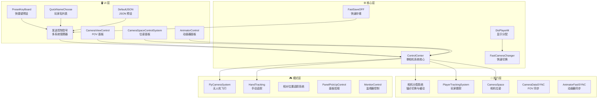

# VRChat Technical Director System

> 🎬 一套用于 VRChat World 的虚拟影视拍摄 / 多机位导播系统，模拟真实电视制作中的"技术导演"(Technical Director) 工作流。

[](https://unity.com/)
[](https://vrchat.com/)
[](https://github.com/vrchat-community/UdonSharp)
[]()

---

## 📖 概述

**VRChat Technical Director System** 让玩家在 VRChat 世界中实现专业级多机位拍摄与导播。它支持多台虚拟摄像机同时运行，每台可独立配置跟踪目标、画面输出、FOV 参数，并通过导演控制台完成实时切换。系统灵感来源于真实广播电视制作中的 **CCU (Camera Control Unit)** 与 **视频切换台** 的工作方式。

### 核心能力

| 模块 | 说明 |
|------|------|
| 📷 **多相机系统** | 多个独立相机实例，各自配置跟踪目标与渲染输出 |
| 🎯 **玩家跟踪** | 跟踪头部 / 左手 / 右手 / 模型原点，支持位置 & 旋转偏移 |
| 🔄 **平滑缓动** | Slerp 锚点过渡，可分轴独立控制缓动速度 |
| 🎚️ **FOV 控制** | 自动速率模式 + 手动缓冲模式，支持网络同步 |
| 🎬 **Animator 遥控** | 远程控制 Float / Int / Bool 参数，带自动播放 |
| 🖥️ **多显示器输出** | 相机画面动态分配到多个屏幕材质 |
| 🚁 **无人机模式** | 第一人称飞行 (Station 进入)，VR / PC 双模式 |
| ✋ **手动追踪** | 手动控制跟踪点位，支持相对追踪与自动追踪 |
| 💾 **预设系统** | JSON 配置存取，Ctrl+0~9 快捷键切换 |
| 📺 **可拾取监视器** | 抓取式监视器屏幕，RenderTexture 切换与缩放 |

---

## 🏗️ 系统架构



### 网络同步策略

| 脚本 | 同步模式 | 原因 |
|------|----------|------|
| `ControlCenter` | `Manual` | 离散状态变更，按需同步 |
| `CameraViewControl` | `Continuous` | FOV 连续变化需实时同步 |
| `CameraDataSYNC` | `Manual` | FOV 按需同步 |
| `AnimatorControl` | `Manual` | 离散参数变更 |
| `AnimatorFastSYNC` | `Continuous` | Float 值连续插值 |
| `DisPlayerM` | `Manual` | 切换信号 |
| `PlayerTrackingSystem` | `Manual` + `[NetworkCallable]` | 离散配置 + SDK 3.8.1+ 新 API |
| `HandTracking` | `Manual` | 离散参数 |
| `FastSaveOFF` | `Manual` | 存储操作 |
| `CameraSpace` | `Manual` | 位姿变更 |
| `发送控制信号` | `NoVariableSync` | 纯本地 UI |

---

## 📁 仓库结构

```
Assets/RhineLab/VRChat Technical Director system/
├── Animator/          # Animator Controller 与动画片段
├── Material/          # 材质（显示器、UI面板、全屏材质等）
├── MODEL/             # 3D 模型（frame.fbx, roundbox.fbx）
├── Perfeb/            # 预制体（相机系统全套、子组件）
├── rounded_trail/     # 自定义圆角拖尾 Shader
├── Scene/             # 示例场景（SP2.unity, sample.unity）
├── Texture/           # RenderTexture 资产
├── UI/                # UI 图标纹理与字体
├── UScrip/            # 🧠 核心 UdonSharp 脚本（33 个）
│   ├── ControlSystem/ # 控制中心、相机分配、玩家跟踪
│   ├── Camera*.cs     # 相机 FOV / 空间位姿 / 数据同步
│   ├── Animator*.cs   # Animator 控制与快速同步
│   └── ...
├── vrchat-screen-space-camera-render-texture-main/  # 屏幕空间相机 RT 方案
└── PROJECT_DOCUMENTATION.md  # 完整技术文档
```

> 📦 **注意**：本仓库 **仅包含核心代码**。运行所需的 VRChat SDK、UdonSharp、UniTask 等依赖请通过 [VRChat Creator Companion (VCC)](https://vrchat.com/download/vcc) 安装，或在 [Releases](https://github.com/RhineLab-magellan/VRChat-Technical-Director-System/releases) 中获取完整发行包。

---

## 🚀 快速开始

### 前置依赖

通过 VCC 创建 VRChat World 项目后，确保已安装：

| 依赖 | 版本要求 | 安装方式 |
|------|---------|---------|
| VRChat World SDK | 3.x | VCC |
| UdonSharp | 1.x | VCC |
| UniTask | - | VCC (可选，部分脚本引用) |
| TextMesh Pro | - | Unity 内置 |

### 安装步骤

```bash
# 1. 克隆本仓库到你的 VRChat World 项目
git clone https://github.com/RhineLab-magellan/VRChat-Technical-Director-System.git
```

然后将 `Assets/RhineLab/VRChat Technical Director system/` 文件夹复制到你的 Unity 项目的 `Assets/RhineLab/` 路径下。

### 场景设置

1. 打开示例场景 `Scene/sample.unity` 或 `Scene/SP2.unity`
2. 将 `Perfeb/相机系统（全套）.prefab` 拖入场景
3. 配置各相机的 RenderTexture 输出到显示器材质
4. 运行，通过控制面板体验导播工作流

### 快捷键

| 快捷键 | 功能 |
|--------|------|
| `Ctrl + 0~9` | 快速切换 / 存储相机预设 |

---

## 📡 同步架构详解

### 网络重传机制 (SafeMod)

`ControlCenter` 实现了可靠的网络重传逻辑：

```
Owner 发起变更
    │
    ├─ RequestSerializationSafe()
    │       │
    │       └─ 向所有客户端广播 NetworkStart1
    │
    ├─ 非 Owner 客户端收到 → 响应 NetworkS
    │
    ├─ Owner 收到所有响应 → RequestSerialization()
    │
    └─ 10 秒超时 → NetworkError → 重新 RequestSerialization()
```

### PlayerTrackingSystem 调用链

```
CallTempChanger()
    → NetworkCalling.SendCustomNetworkEvent
        → SetTrackingDataType()
            → 延迟 1s
                → NetworkingCall()
                    → RequestSerialization()
```

---

## 📝 全部脚本清单

| 脚本 | 功能 | 同步模式 |
|------|------|----------|
| `ControlCenter.cs` | 单相机系统核心控制器 | Manual |
| `CameraViewControl.cs` | FOV 面板与控制 | Continuous |
| `CameraDataSYNC.cs` | FOV 数据网络同步 | Manual |
| `CameraSpace.cs` | 相机空间位姿 | Manual |
| `CameraSpaceControlSystem.cs` | 相机位姿面板 UI | - |
| `PlayerTrackingSystem.cs` | 玩家头部/手部/原点跟踪 | Manual |
| `PlayerTrackingControl.cs` | 跟踪面板 UI | - |
| `AnimatorControl.cs` | Animator 参数远程控制 | Manual |
| `AnimatorFastSYNC.cs` | Animator 快速同步 | Continuous |
| `FlyCameraSystem.cs` | 无人机飞行 (Station) | - |
| `FlyCameraVRTracking.cs` | 无人机 VR 跟踪 | - |
| `HandTracking.cs` | 手动追踪模式 | Manual |
| `HandTracking2.cs` | 手动追踪扩展 | - |
| `HandGetTracking.cs` | 手动追踪数据获取 | - |
| `DisPlayerM.cs` | 多显示器画面分配 | Manual |
| `FastCameraChanger.cs` | 快速输出切换面板 | - |
| `FastSaveOFF.cs` | 快速存储 | Manual |
| `DefaultJSON.cs` | JSON 预设存取 | - |
| `PresetKeyBoard.cs` | 快捷键预设管理 | - |
| `QuickNameChoose.cs` | 玩家名列表 UI | - |
| `BottonIndex.cs` | 按钮索引映射 | - |
| `MonitorControl.cs` | 可拾取监视器控制 | - |
| `PanelPickUpControl.cs` | 面板拾取交互 | - |
| `VRPickUp.cs` | VR 拾取逻辑 | - |
| `UserControlPanle.cs` | 用户控制面板 | - |
| `GetContext.cs` | 上下文获取工具 | - |
| `TeleportGameObject.cs` | 传送物体工具 | - |
| `RelativeCenter.cs` | 相对位置中心 | - |
| `RelativeControl.cs` | 相对位置控制 | - |
| `RelativeTracking.cs` | 相对位置追踪 | - |
| `RelativeOffset.cs` | 相对偏移量 | - |
| `RelativeLineRender.cs` | 相对追踪线渲染 | - |

---

## ⚠️ 已知限制

| 限制 | 说明 | 影响 |
|------|------|------|
| Owner 依赖 | 多数同步操作需 Ownership | 非 Owner 无法直接控制相机 |
| Quest 性能 | 同时运行多个相机 RT 开销大 | 建议 Quest 上限 1~2 个相机 |
| SafeMod 延迟 | 网络重传机制存在最多 10s 延迟 | 高延迟房间中操作响应变慢 |
| Udon 程序大小 | 大量脚本导致 Udon Assembly 较大 | 接近 VRChat 容量上限 |

---

## 🔗 相关链接

- [完整技术文档](./Assets/RhineLab/VRChat%20Technical%20Director%20system/PROJECT_DOCUMENTATION.md)
- [VRChat Creator Companion](https://vrchat.com/download/vcc)
- [UdonSharp 文档](https://github.com/vrchat-community/UdonSharp)
- [VRChat World SDK 文档](https://creators.vrchat.com/worlds/)

---

## 📄 许可证

本项目代码部分采用 MIT 许可证。详见 [LICENSE](./LICENSE)。

> 🎮 依赖项 (VRChat SDK, UdonSharp 等) 遵循各自原始许可证。
